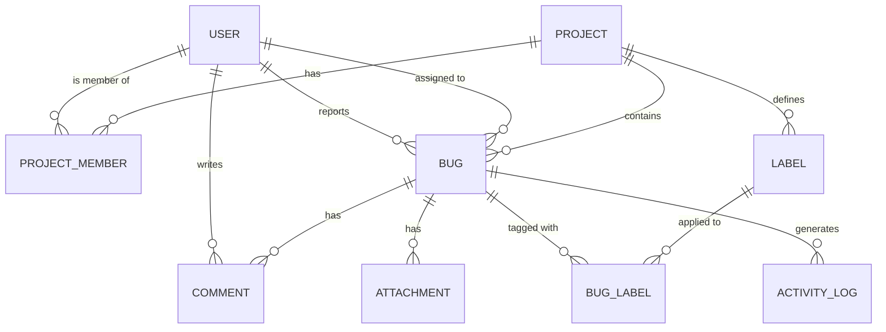

# 🐛 BugTrackr — Master Project Document
> **A lightweight, student-friendly bug & project tracking SPA built with Angular 18+**
> *Inspired by Jira & Linear — designed for students, small teams, and graduation projects*

---

## 📌 Table of Contents
1. [Project Vision](#vision)
2. [Architecture](#architecture)
3. [Design Patterns](#design-patterns)
4. [Tech Stack](#tech-stack)
5. [Feature Breakdown (All Sprints)](#features)
6. [Sprint Plan](#sprints)
7. [UI/UX System](#uiux)
8. [Performance Strategy](#performance)
9. [Theming & Accessibility](#theming)
10. [AI Prompt for Implementation](#prompt)
11. [API Contract & Data Models](#api)
12. [Error Handling & Resilience](#error-handling)
13. [Testing Strategy](#testing)
14. [Security Considerations](#security)
15. [Deployment & CI/CD](#deployment)
16. [Git Workflow](#git-workflow)

---

## 🎯 1. Project Vision {#vision}

**BugTrackr** is a modern, real-time bug tracking and project management SPA for students and small dev teams. It strips away enterprise complexity and gives teams the core workflow they need: create projects, log bugs, assign work, track progress, and visualize team productivity — all wrapped in a stunning, themeable UI with smooth animations.

**Target Users:**
- Students working on graduation projects
- Small dev teams (2–10 people)
- Bootcamp cohorts
- Freelance teams

**Core Value Prop:**
- Zero friction onboarding (sign up → create project in 60 seconds)
- Beautiful, fast, mobile-friendly UI
- Light/Dark/Custom themes
- No enterprise bloat

---

## 🏗️ 2. Architecture {#architecture}

### Pattern: **Feature-Based Modular Architecture + Smart/Dumb Component Pattern**

```
src/
├── app/
│   ├── core/                        # Singleton services, guards, interceptors
│   │   ├── auth/
│   │   │   ├── auth.service.ts
│   │   │   ├── auth.guard.ts
│   │   │   └── jwt.interceptor.ts
│   │   ├── services/
│   │   │   ├── api.service.ts       # Base HTTP abstraction
│   │   │   ├── theme.service.ts
│   │   │   └── toast.service.ts
│   │   └── models/                  # Interfaces & Types
│   │       ├── user.model.ts
│   │       ├── project.model.ts
│   │       ├── bug.model.ts
│   │       └── comment.model.ts
│   │
│   ├── shared/                      # Reusable dumb components & pipes
│   │   ├── components/
│   │   │   ├── badge/
│   │   │   ├── avatar/
│   │   │   ├── modal/
│   │   │   ├── confirm-dialog/
│   │   │   ├── skeleton-loader/
│   │   │   ├── empty-state/
│   │   │   ├── search-input/
│   │   │   ├── priority-badge/
│   │   │   └── status-chip/
│   │   ├── pipes/
│   │   │   ├── time-ago.pipe.ts
│   │   │   ├── truncate.pipe.ts
│   │   │   └── priority-color.pipe.ts
│   │   └── directives/
│   │       ├── auto-focus.directive.ts
│   │       ├── click-outside.directive.ts
│   │       └── tooltip.directive.ts
│   │
│   ├── features/                    # Lazy-loaded feature modules
│   │   ├── auth/
│   │   │   ├── login/
│   │   │   ├── register/
│   │   │   └── auth.routes.ts
│   │   ├── dashboard/
│   │   │   ├── dashboard.component.ts
│   │   │   ├── widgets/
│   │   │   │   ├── bug-stats-chart/
│   │   │   │   ├── recent-activity/
│   │   │   │   └── team-leaderboard/
│   │   │   └── dashboard.routes.ts
│   │   ├── projects/
│   │   │   ├── project-list/
│   │   │   ├── project-detail/
│   │   │   ├── project-create/
│   │   │   └── projects.routes.ts
│   │   ├── bugs/
│   │   │   ├── bug-list/
│   │   │   ├── bug-detail/
│   │   │   ├── bug-create/
│   │   │   ├── bug-board/          # Kanban view
│   │   │   └── bugs.routes.ts
│   │   ├── members/
│   │   │   ├── member-list/
│   │   │   └── invite-member/
│   │   └── settings/
│   │       ├── profile/
│   │       └── theme-settings/
│   │
│   ├── layout/
│   │   ├── shell/                   # App shell with sidebar
│   │   ├── sidebar/
│   │   ├── topbar/
│   │   └── page-wrapper/
│   │
│   └── app.routes.ts               # Root routing with lazy loading
│
├── environments/
│   ├── environment.ts
│   └── environment.prod.ts
└── styles/
    ├── themes/
    │   ├── _dark.scss
    │   ├── _light.scss
    │   ├── _rose.scss               # Pink/feminine theme
    │   ├── _ocean.scss
    │   └── _forest.scss
    ├── _variables.scss
    ├── _animations.scss
    └── styles.scss
```

### State Management: **NgRx Signals (Angular 18 Signal Store)**
- Lightweight, no boilerplate
- `signalStore()` per feature (AuthStore, ProjectsStore, BugsStore, UIStore)
- Computed signals for derived state
- Effects for async operations

---

## 🎨 3. Design Patterns {#design-patterns}

| Pattern | Where Used | Why |
|---|---|---|
| **Smart/Dumb Components** | All features | Separation of concerns, reusability |
| **Repository Pattern** | `*-api.service.ts` files | Abstract HTTP layer, easy to mock |
| **Facade Pattern** | Feature stores as facades | Components talk to store, not services directly |
| **Observer Pattern** | Signals + RxJS | Reactive UI updates |
| **Strategy Pattern** | Theme service | Swap themes at runtime |
| **Builder Pattern** | Form construction | Dynamic form generation |
| **Skeleton Pattern** | Loading states | Better perceived performance |
| **Command Pattern** | Bug status transitions | Encapsulate state changes with undo support |

---

## 🛠️ 4. Tech Stack {#tech-stack}

### Core
| Technology | Version | Purpose |
|---|---|---|
| **Angular** | 18+ | SPA Framework |
| **TypeScript** | 5.4+ | Type safety |
| **Angular Signals** | Built-in | Reactive state |
| **NgRx Signal Store** | 18+ | Global state management |
| **Angular Router** | Built-in | Lazy loading, guards |
| **RxJS** | 7.8+ | Async streams |

### Styling & UI
| Technology | Purpose |
|---|---|
| **Tailwind CSS v3** | Utility-first styling + custom config |
| **Angular Animations** | Route transitions, micro-interactions |
| **GSAP (GreenSock)** | Complex animation sequences |
| **Chart.js + ng2-charts** | Dashboard charts |
| **Lucide Angular** | Modern icon set |
| **CDK (Angular CDK)** | Drag & drop (Kanban board), overlays |

### Backend Integration
| Technology | Purpose |
|---|---|
| **HttpClient** | API communication |
| **JWT (jose/jwt-decode)** | Token parsing & refresh |
| **HTTP Interceptors** | Auto-attach token, error handling |
| **WebSockets (optional)** | Real-time comment notifications |

### Forms & Validation
| Technology | Purpose |
|---|---|
| **Reactive Forms** | All forms |
| **Zod (optional)** | Runtime schema validation |
| **Custom Validators** | Business logic validation |

### Developer Experience
| Technology | Purpose |
|---|---|
| **ESLint + Prettier** | Code quality |
| **Husky + lint-staged** | Pre-commit hooks |
| **Jest** | Unit testing |
| **Cypress** | E2E testing |
| **Storybook** | Component documentation |

---

## 📋 5. Feature Breakdown {#features}

---

### 🔐 AUTH MODULE

#### F-01: User Registration
- **Fields:** Full Name, Email, Password, Confirm Password, Avatar Upload (optional)
- **Validation:** Email uniqueness check (debounced async), password strength meter
- **UX:** Step-by-step animated form (2 steps), real-time feedback
- **Storage:** JWT in `localStorage` + refresh token in `httpOnly` cookie (if backend supports)

#### F-02: User Login
- **Fields:** Email, Password, Remember Me
- **Features:** Show/hide password, loading state, error inline messages
- **UX:** Smooth slide-in animation, shake effect on wrong credentials

#### F-03: JWT Auth Guard
- Route guards for all protected routes
- Token expiry auto-check
- Redirect to `/auth/login` with `returnUrl`
- Auto-refresh token before expiry (interceptor)

#### F-04: Profile Settings
- Update name, avatar, password
- Delete account option (with confirmation)

---

### 📁 PROJECTS MODULE

#### F-05: Create Project
- **Fields:** Name, Description, Type (Web App / Mobile App / Graduation Project / Team Assignment / Other), Color/Icon picker, Visibility (Private / Team)
- **UX:** Modal with animated steps, live preview of project card

#### F-06: Project List
- Grid/List toggle view
- Project cards with: name, type badge, bug count, member avatars, last activity
- Quick-action menu (Edit, Archive, Delete)
- Empty state illustration when no projects

#### F-07: Project Detail
- Tabs: **Overview** | **Bugs** | **Members** | **Settings**
- Overview: stats cards, recent bugs, activity feed
- Bug count breakdown by status (mini chart)

#### F-08: Archive / Delete Project
- Soft-delete with recovery period
- Confirmation dialog with project name typing
- Archive hides from main list but keeps data

---

### 🐛 BUGS MODULE

#### F-09: Bug List View
- Table view with sortable columns
- **Columns:** #ID | Title | Priority | Status | Assigned To | Labels | Created | Updated
- Bulk actions: Change status, Assign, Delete
- Inline status change (click status chip → dropdown)

#### F-10: Kanban Board View  ⭐ *Enhanced Suggestion*
- Drag-and-drop columns: Open → In Progress → Testing → Blocked → Closed
- Card shows: title, priority dot, assignee avatar, label tags
- Column header shows count + color
- Collapse columns
- Uses Angular CDK DragDrop
- Swim lanes by assignee (toggle)

#### F-11: Create Bug / Issue
- **Required:** Title, Description (Rich text editor - Quill), Priority, Status
- **Optional:** Assignee, Labels (multi-select), Due Date, Attachments
- **UX:** Sliding drawer from right side, autosave draft

#### F-12: Bug Detail Page
- Full page with:
  - Title (inline editable)
  - Status chip (clickable dropdown)
  - Priority badge
  - Description (rich text, editable)
  - Metadata sidebar: Assignee, Reporter, Labels, Created/Updated dates, Project
  - Activity log (who changed what + when)
  - Comments section

#### F-13: Bug Edit
- Same drawer as create, pre-filled
- Change history tracked

#### F-14: Bug Delete
- Soft delete, only creator or project admin can delete
- Undo toast (5 seconds)

---

### 🔖 STATUS SYSTEM

```
Open → In Progress → Testing → Closed
         ↑_____________|         (can reopen)
```

**Statuses:**
| Status | Color | Icon |
|---|---|---|
| Open | `#EF4444` Red | Circle |
| In Progress | `#F59E0B` Amber | Spinner |
| Testing | `#8B5CF6` Purple | Flask |
| Closed | `#10B981` Green | CheckCircle |
| Blocked | `#6B7280` Gray | Ban |  *(bonus)* |

---

### 🎯 PRIORITY SYSTEM

| Priority | Color | Icon |
|---|---|---|
| Critical | `#DC2626` | 🔥 Flame |
| High | `#F97316` | ↑↑ Double Arrow |
| Medium | `#EAB308` | → Arrow |
| Low | `#22C55E` | ↓ Down Arrow |

---

### 💬 COMMENTS MODULE

#### F-15: Add Comment
- Text area with Markdown support (preview toggle)
- @mention members (typeahead)
- Emoji reactions on comments
- Edit/Delete own comments

#### F-16: Activity Feed
- System-generated entries for all changes
- "John changed status from Open → In Progress · 2h ago"
- Different icons per action type

---

### 🏷️ LABELS MODULE

#### F-17: Labels Management
- Predefined: `frontend`, `backend`, `ui`, `database`, `api`, `devops`, `docs`
- Create custom labels with color picker
- Assign multiple labels per bug
- Filter by label

---

### 📎 ATTACHMENTS MODULE  *(Enhanced)*

#### F-18: File Attachments
- Drag & drop or click to upload
- Preview: images show thumbnail, others show file icon + name
- Max 10MB per file, max 5 files per bug
- Delete attachment (with confirm)
- Supported: Images (PNG/JPG/GIF/WebP), PDFs, ZIP

---

### 🔍 SEARCH & FILTER MODULE

#### F-19: Global Search
- `Cmd/Ctrl + K` keyboard shortcut opens command palette
- Fuzzy search across bug titles and descriptions
- Results grouped by project
- Recent searches saved locally

#### F-20: Bug Filters
- Filter panel (collapsible sidebar or popover):
  - Status (multi-select)
  - Priority (multi-select)
  - Assigned To (member picker)
  - Labels (multi-select)
  - Date Range (created / updated)
  - Reporter
- Active filters shown as chips with × remove
- Save filter presets

---

### 📊 DASHBOARD MODULE

#### F-21: Stats Overview Cards
- Total Open Bugs
- Bugs Closed This Week
- Avg Resolution Time
- My Assigned Bugs

#### F-22: Charts  *(Enhanced)*
- **Donut Chart:** Bug distribution by status
- **Bar Chart:** Bugs created vs closed per week (last 4 weeks)
- **Leaderboard:** Top bug closers this month (with avatars)
- **Line Chart:** Bug trend over time (30 days)
- **Heatmap (bonus):** Activity by day of week

#### F-23: Recent Activity Feed
- Cross-project feed
- Filter by project or member

#### F-24: My Work Widget
- Bugs assigned to me (grouped by priority)
- Quick status update from dashboard

---

### 👥 MEMBERS MODULE

#### F-25: Invite Member
- Invite by email (sends link)
- Role: Owner / Admin / Developer / Viewer

#### F-26: Member List
- Avatar, name, email, role, bugs assigned count
- Remove member (owner only)
- Change role

---

### ⚙️ SETTINGS MODULE

#### F-27: Theme Settings  ⭐
- Select from 5 themes: Default Dark, Default Light, Rose (girls), Ocean Blue, Forest Green
- Toggle dark/light within theme
- Primary color custom picker (for power users)
- Font size preference (Small/Medium/Large)

#### F-28: Notification Preferences
- Email notifications (toggle per event)
- In-app notifications (bell icon, real-time if WebSocket)

#### F-29: Project Settings
- Edit name, description, type
- Transfer ownership
- Danger Zone: Archive / Delete

---

## 🏃 6. Sprint Plan {#sprints}

### ✅ Definition of Done (DoD)
Every task is considered **done** when:
- Code compiles with zero errors and zero warnings
- Component has OnPush change detection
- Loading skeleton is implemented
- Empty state is handled
- Responsive on mobile (xs) and desktop (xl)
- Basic unit test exists for the store/service
- Accessibility: keyboard navigable, ARIA labels present

### Sprint 0 — Setup (3 days) `~8 SP`
- [ ] Angular project init with Tailwind config
- [ ] Folder structure setup
- [ ] Theme system + CSS variables (all 5 themes)
- [ ] Core module: API service, JWT interceptor, Auth guard
- [ ] Shared components: Badge, Avatar, Modal skeleton
- [ ] Route structure with lazy loading
- [ ] ESLint + Prettier configuration
- [ ] Husky + lint-staged setup
- [ ] Storybook initialization
- [ ] Git repo + branching strategy (see Section 15)

### Sprint 1 — Auth & Shell (4 days) `~13 SP`
- [ ] Login page with animations
- [ ] Register page (2-step)
- [ ] App shell layout (sidebar + topbar)
- [ ] Responsive sidebar (collapse on mobile)
- [ ] Protected route navigation
- [ ] Auth store (NgRx Signals)
> ⚠️ **Risk:** JWT refresh flow depends on backend token endpoint— mock if backend not ready

### Sprint 2 — Projects (4 days) `~13 SP`
- [ ] Project list page
- [ ] Project create modal
- [ ] Project detail tabs
- [ ] Projects store
- [ ] Empty states
> ⚠️ **Dependency:** Requires Auth (Sprint 1) complete

### Sprint 3 — Bugs Core (6 days) `~21 SP`
- [ ] Bug list table view
- [ ] Bug create drawer
- [ ] Bug detail page
- [ ] Bug edit
- [ ] Status/Priority inline editing
- [ ] Bugs store
> ⚠️ **Dependency:** Requires Projects (Sprint 2) for project context

### Sprint 4 — Kanban + Comments (4 days) `~13 SP`
- [ ] Kanban board with CDK drag-drop (5 columns including Blocked)
- [ ] Comments with activity feed
- [ ] @mention typeahead
- [ ] Emoji reactions

### Sprint 5 — Filters + Search (3 days) `~8 SP`
- [ ] Filter panel component
- [ ] Active filter chips
- [ ] Command palette (Cmd+K)
- [ ] URL-synced filters

### Sprint 6 — Dashboard (4 days) `~13 SP`
- [ ] Stats cards with count-up animation
- [ ] All charts (Chart.js)
- [ ] Activity feed
- [ ] My work widget
> ⚠️ **Dependency:** Requires Bugs data (Sprint 3)

### Sprint 7 — Advanced Features (4 days) `~13 SP`
- [ ] File attachments
- [ ] Labels management
- [ ] Members module
- [ ] Notifications bell

### Sprint 8 — Theming + Polish (3 days) `~8 SP`
- [ ] All 5 themes polished
- [ ] Page transitions (route animations)
- [ ] Loading skeletons everywhere
- [ ] Mobile responsiveness audit
- [ ] Accessibility pass (ARIA, keyboard nav)

### Sprint 9 — Testing + Docs (3 days) `~8 SP`
- [ ] Unit tests for stores and services (see Section 12)
- [ ] E2E tests for critical flows
- [ ] Storybook stories
- [ ] README documentation

> **Total: ~38 working days | ~118 Story Points**
> Adjust velocity based on team size (solo ≈ 3–5 SP/day, team of 4 ≈ 12–20 SP/day)

---

## 🎨 7. UI/UX System {#uiux}

### Design Language: **"Precision Dark"**
A modern developer tool aesthetic — dark-first, accent-colored, information-dense but breathable. Think Linear meets Vercel dashboard.

### Color System (CSS Variables)

```scss
// Base (Dark Theme — Default)
--bg-base: #0A0A0F;
--bg-surface: #13131A;
--bg-elevated: #1C1C27;
--bg-hover: #252535;
--border: #2A2A3E;
--border-strong: #3D3D5C;

// Text
--text-primary: #F0F0FF;
--text-secondary: #9090B0;
--text-muted: #60607A;

// Accent (Default: Electric Violet)
--accent: #7C3AED;
--accent-bright: #9D5FF0;
--accent-subtle: rgba(124, 58, 237, 0.15);

// Semantic
--success: #10B981;
--warning: #F59E0B;
--error: #EF4444;
--info: #3B82F6;

// Rose Quartz Theme
// (Applied via `.theme-rose` class on <body>)
.theme-rose {
  --bg-base: #0F0A0F;
  --bg-surface: #1A1018;
  --accent: #EC4899;
  --accent-bright: #F472B6;
  --border: #2E1A2A;
}
```

### Typography
```scss
// Headings: "Syne" — geometric, modern, strong personality
// Body: "DM Sans" — clean, readable, professional  
// Mono: "JetBrains Mono" — code snippets, IDs
// Accent: "Syne Mono" — special callouts

@import url('https://fonts.googleapis.com/css2?family=Syne:wght@600;700;800&family=DM+Sans:ital,wght@0,300;0,400;0,500;1,400&family=JetBrains+Mono:wght@400;500&display=swap');
```

### Animation System

```scss
// Route transitions
.page-enter { opacity: 0; transform: translateY(8px); }
.page-enter-active { 
  transition: opacity 200ms ease, transform 200ms ease; 
}

// Card hover (applied globally to .card class)
.card {
  transition: transform 150ms ease, box-shadow 150ms ease, border-color 150ms ease;
  &:hover {
    transform: translateY(-2px);
    box-shadow: 0 8px 24px rgba(0,0,0,0.3);
    border-color: var(--accent-subtle);
  }
}

// Skeleton shimmer
@keyframes shimmer {
  from { background-position: -200% 0; }
  to   { background-position: 200% 0; }
}

// Priority pulse (Critical bugs pulse red)
@keyframes criticalPulse {
  0%, 100% { box-shadow: 0 0 0 0 rgba(220, 38, 38, 0.4); }
  50%       { box-shadow: 0 0 0 6px rgba(220, 38, 38, 0); }
}

// Count-up for dashboard numbers
// (JS-based: 0 → target over 800ms with easing)

// Drag ghost (Kanban)
.cdk-drag-placeholder { opacity: 0.3; border: 2px dashed var(--accent); }
.cdk-drag-animating { transition: transform 250ms cubic-bezier(0, 0, 0.2, 1); }
```

### Component Design Decisions

| Component | Design Choice |
|---|---|
| Sidebar | Collapsible, icon-only mode, sticky, projects pinned |
| Bug cards | Left-side colored priority bar |
| Status chips | Pill shape, colored dot + label |
| Modals | Slide-up on mobile, center fade on desktop |
| Empty states | Illustrated SVG + CTA button |
| Tables | Sticky header, alternating rows, hover highlight |
| Toasts | Bottom-right stack, auto-dismiss with progress bar |
| Command palette | Blur backdrop, fuzzy match highlight |
| Charts | Custom tooltips matching theme |

---

### Gender-Inclusive Theme System  🎨

| Theme | Vibe | Primary | Accent |
|---|---|---|---|
| **Void Dark** *(default)* | Developer precision | `#0A0A0F` | `#7C3AED` violet |
| **Clean Light** | Minimal, bright | `#FAFAFA` | `#2563EB` blue |
| **Rose Quartz** | Warm, feminine | `#0F0A0F` | `#EC4899` pink |
| **Ocean Deep** | Calm, professional | `#070F1A` | `#0EA5E9` cyan |
| **Forest Moss** | Earthy, focused | `#0A0F0A` | `#22C55E` green |

All themes support both dark and light variants (10 combos total).

---

## ⚡ 8. Performance Strategy {#performance}

### Bundle Optimization
- **Lazy loading** every feature route (`loadComponent`, `loadChildren`)
- **Tree-shaking** — no barrel imports, named imports only
- **Standalone components** throughout (no NgModules)
- `@defer` blocks for below-fold content (chart widgets)

### Change Detection
- **OnPush everywhere** — no default CD
- **Signals-first** — avoid Subject/BehaviorSubject where Signal works
- Use Angular 18 `@for` with built-in `track` expression (replaces legacy `*ngFor` + `trackBy`)
- Use Angular 18 `@if` / `@switch` control flow (replaces `*ngIf` / `*ngSwitch`)
- `async` pipe over manual subscriptions (where Signals are not applicable)

### Data Fetching
- HTTP caching in `api.service.ts` with `Map<string, Observable>` and TTL
- Optimistic UI updates (update store immediately, rollback on error)
- Debounce search input (300ms) with `switchMap`
- Infinite scroll for bug lists (not pagination) — better mobile UX

### Image & Asset Optimization
- Lazy load images (`loading="lazy"`)
- WebP format preference
- Avatar initials fallback (no broken images)
- SVG icons inlined (no icon font HTTP requests)

### Perceived Performance
- Skeleton screens for every loading state
- Instant navigation feedback (topbar progress bar)
- Stale-while-revalidate pattern for lists
- Preload adjacent routes on hover

---

## ♿ 9. Theming & Accessibility {#theming}

### Accessibility Checklist
- [ ] All interactive elements reachable via keyboard
- [ ] `Tab` focus visible (custom focus ring using `--accent`)
- [ ] ARIA labels on icon-only buttons
- [ ] Status chips use `role="status"` 
- [ ] Modals trap focus, close on `Escape`
- [ ] Color is never the only indicator (always icon + color)
- [ ] Min contrast ratio 4.5:1 for normal text
- [ ] `prefers-reduced-motion` respected
- [ ] Screen reader tested (NVDA/VoiceOver)

### Responsive Breakpoints (Tailwind Config)
```js
screens: {
  xs: '375px',  // Small phones
  sm: '640px',  // Large phones
  md: '768px',  // Tablets
  lg: '1024px', // Small laptops
  xl: '1280px', // Desktops
  '2xl': '1536px' // Wide screens
}
```

**Mobile adaptations:**
- Sidebar becomes bottom tab bar on mobile
- Kanban board: horizontal scroll with snap
- Bug detail: full-screen modal instead of page
- Tables: card view on xs/sm

---

## 🤖 10. AI Implementation Prompt {#prompt}

```
You are an expert Angular 18+ developer and UI/UX engineer. Your task is to build
"BugTrackr" — a professional, production-ready bug tracking SPA for students and
small dev teams. This is a portfolio-grade project requiring exceptional code quality
and stunning visual design.

═══════════════════════════════════════════════════════════════
PROJECT: BugTrackr — Lightweight Bug & Project Tracker
STACK: Angular 18 + NgRx Signal Store + Tailwind CSS + Chart.js + Angular CDK
═══════════════════════════════════════════════════════════════

━━━ ARCHITECTURE REQUIREMENTS ━━━

1. Use Angular 18 standalone components ONLY (no NgModules)
2. Feature-based folder structure (see BUGTRACKR_MASTER.md)
3. Smart/Dumb component pattern strictly enforced
4. NgRx Signal Store for state (signalStore per feature)
5. Repository pattern for all API calls (dedicated *-api.service.ts)
6. Lazy loading for every feature route using loadComponent/loadChildren
7. OnPush change detection on every component
8. Angular Animations for route transitions and micro-interactions

━━━ WHEN BUILDING EACH FEATURE ━━━

Follow this order for each feature:
  Step 1: Define the TypeScript interface in core/models/
  Step 2: Create the Signal Store with state, computed, and updaters
  Step 3: Create the API service with proper error handling
  Step 4: Build dumb/presentational components first
  Step 5: Build smart container component that connects store
  Step 6: Add loading skeletons and empty states
  Step 7: Add animations

━━━ UI/UX REQUIREMENTS ━━━

Design Language: "Precision Dark" — modern developer tool aesthetic
- Dark-first design using CSS custom properties for theming
- Font stack: Syne (headings) + DM Sans (body) + JetBrains Mono (code)
- 5 complete themes: Void Dark / Clean Light / Rose Quartz / Ocean Deep / Forest Moss
- Tailwind CSS with custom theme config extending the design tokens
- GSAP or Angular Animations for:
  • Page transitions (fade + translateY 8px)
  • Card hover states (lift + shadow)
  • Number count-up animations on dashboard
  • Skeleton shimmer loading
  • Drag ghost on Kanban
  • Toast slide-in/out

━━━ FEATURE LIST TO IMPLEMENT ━━━

[AUTH]
- Register (2-step animated form with progress bar)
- Login (shake animation on error, password strength meter)
- JWT interceptor with auto-refresh
- Auth guard with returnUrl

[LAYOUT]
- App shell with collapsible sidebar (icon-only on collapse)
- Topbar: breadcrumb, global search trigger, notifications bell, user menu
- Mobile: bottom tab bar replaces sidebar
- Route-level loading bar (slim progress bar at top)

[PROJECTS]
- Project list: grid view with animated cards
- Create project: modal with type selector (icon buttons for each type)
- Project detail: tabs (Overview | Bugs | Members | Settings)
- Color/icon picker for project branding

[BUGS]
- Bug list: sortable table with inline status editing
- Kanban board: CDK drag-drop with 5 columns (Open/In Progress/Testing/Blocked/Closed)
- Create bug: right-side sliding drawer, autosaves draft to localStorage
- Bug detail: full page with editable fields, metadata sidebar, activity log
- Priority system: Critical (pulsing red), High (orange), Medium (yellow), Low (green)
- Bulk actions toolbar (appears on row selection)

[COMMENTS & ACTIVITY]
- Markdown comment editor with preview toggle
- @mention typeahead dropdown
- Activity log with action icons and time-ago timestamps
- Emoji reactions (👍 ❤️ 🎉 🐛 🔥)

[SEARCH & FILTERS]
- Cmd+K command palette with fuzzy search
- Filter panel: status (multi), priority (multi), assignee, labels, date range
- Active filters as removable chips
- URL query param sync for shareable filter state

[DASHBOARD]
- Stats cards with count-up animation on enter
- Donut chart: bugs by status
- Bar chart: created vs closed per week
- Activity leaderboard with avatars
- My bugs widget grouped by priority

[SETTINGS]
- Theme picker: visual swatches for all 5 themes
- Profile: avatar upload with crop, name, password change
- Notification preferences
- Danger zone (delete account)

━━━ CODE QUALITY REQUIREMENTS ━━━

- TypeScript strict mode enabled
- No `any` types — use generics and proper interfaces
- HTTP errors handled uniformly via error interceptor → toast service
- All forms use Reactive Forms with typed FormGroup<T>
- Observables cleaned up: prefer signals, use takeUntilDestroyed() for RxJS
- Meaningful commit messages following Conventional Commits
- All components < 300 lines (extract to sub-components if larger)
- Services follow Single Responsibility Principle

━━━ PERFORMANCE REQUIREMENTS ━━━

- @defer for dashboard charts (load after interaction)
- trackBy functions on every *ngFor
- Use Angular 18 `@for` with built-in `track` (replaces legacy `*ngFor` + trackBy)
- Debounce search: 300ms with switchMap/distinctUntilChanged
- Optimistic UI updates on status changes (instant feedback)
- HTTP caching in api.service.ts (60-second TTL for lists)
- Bundle analysis: no feature chunk > 150KB gzipped

━━━ ACCESSIBILITY ━━━

- All icon-only buttons have aria-label
- Focus management in modals (trap + restore)
- prefers-reduced-motion: disable animations
- Keyboard navigation: Escape closes modals/drawers
- Color contrast: minimum 4.5:1

━━━ START WITH ━━━

Begin by generating:
1. tailwind.config.ts with full design token system (colors, fonts, animations, breakpoints)
2. styles/themes/_dark.scss — the base dark theme variables
3. styles/themes/_rose.scss — the Rose Quartz theme
4. core/models/ — all TypeScript interfaces (User, Project, Bug, Comment, Label, Attachment)
5. core/auth/auth.service.ts + jwt.interceptor.ts + auth.guard.ts
6. The login and register pages with full animations

After each file, confirm before proceeding to the next module.
```

---

## 📦 Quick Start Commands

```bash
# Create Angular project
ng new bugtrackr --routing --style=scss --standalone

# Install dependencies
npm install @ngrx/signals tailwindcss @angular/cdk chart.js ng2-charts gsap lucide-angular quill ngx-quill jwt-decode

# Install dev dependencies
npm install -D prettier eslint-plugin-prettier

# Initialize Tailwind
npx tailwindcss init

# Generate feature structure
ng generate component features/auth/login/login --standalone
ng generate component features/auth/register/register --standalone
# ... etc
```

---

## 🗄️ 11. API Contract & Data Models {#api}

### Entity Relationship Diagram



### TypeScript Interfaces (Core)

```typescript
// core/models/user.model.ts
export interface User {
  id: string;
  fullName: string;
  email: string;
  avatarUrl: string | null;
  role: 'owner' | 'admin' | 'developer' | 'viewer';
  createdAt: string;        // ISO 8601
}

// core/models/project.model.ts
export interface Project {
  id: string;
  name: string;
  description: string;
  type: 'web' | 'mobile' | 'graduation' | 'assignment' | 'other';
  color: string;            // hex
  icon: string;             // lucide icon name
  visibility: 'private' | 'team';
  ownerId: string;
  isArchived: boolean;
  createdAt: string;
  updatedAt: string;
  memberCount: number;      // computed
  openBugCount: number;     // computed
}

// core/models/bug.model.ts
export type BugStatus = 'open' | 'in_progress' | 'testing' | 'blocked' | 'closed';
export type BugPriority = 'critical' | 'high' | 'medium' | 'low';

export interface Bug {
  id: string;
  numericId: number;        // project-scoped sequential ID (#1, #2, ...)
  title: string;
  description: string;      // HTML from Quill editor
  status: BugStatus;
  priority: BugPriority;
  projectId: string;
  reporterId: string;
  assigneeId: string | null;
  labels: Label[];
  attachments: Attachment[];
  dueDate: string | null;
  createdAt: string;
  updatedAt: string;
  closedAt: string | null;
}

// core/models/comment.model.ts
export interface Comment {
  id: string;
  bugId: string;
  authorId: string;
  author: Pick<User, 'id' | 'fullName' | 'avatarUrl'>;
  body: string;             // Markdown
  reactions: Reaction[];
  createdAt: string;
  updatedAt: string;
}

export interface Reaction {
  emoji: '👍' | '❤️' | '🎉' | '🐛' | '🔥';
  userIds: string[];
}

// core/models/label.model.ts
export interface Label {
  id: string;
  name: string;
  color: string;            // hex
  projectId: string;
}

// core/models/attachment.model.ts
export interface Attachment {
  id: string;
  bugId: string;
  fileName: string;
  fileUrl: string;
  fileType: string;         // MIME type
  fileSize: number;         // bytes
  uploadedById: string;
  createdAt: string;
}

// core/models/activity.model.ts
export type ActivityAction =
  | 'created' | 'status_changed' | 'priority_changed'
  | 'assigned' | 'unassigned' | 'label_added' | 'label_removed'
  | 'commented' | 'attachment_added' | 'attachment_removed';

export interface ActivityLog {
  id: string;
  bugId: string;
  userId: string;
  user: Pick<User, 'id' | 'fullName' | 'avatarUrl'>;
  action: ActivityAction;
  oldValue: string | null;
  newValue: string | null;
  createdAt: string;
}
```

### REST API Endpoints (Expected Backend)

| Method | Endpoint | Description |
|---|---|---|
| `POST` | `/api/auth/register` | Register new user |
| `POST` | `/api/auth/login` | Login, returns JWT |
| `POST` | `/api/auth/refresh` | Refresh token |
| `GET` | `/api/users/me` | Current user profile |
| `PUT` | `/api/users/me` | Update profile |
| `GET` | `/api/projects` | List user's projects |
| `POST` | `/api/projects` | Create project |
| `GET` | `/api/projects/:id` | Project detail |
| `PUT` | `/api/projects/:id` | Update project |
| `DELETE` | `/api/projects/:id` | Soft-delete project |
| `GET` | `/api/projects/:id/members` | List members |
| `POST` | `/api/projects/:id/members` | Invite member |
| `GET` | `/api/projects/:id/bugs` | List bugs (filterable) |
| `POST` | `/api/projects/:id/bugs` | Create bug |
| `GET` | `/api/bugs/:id` | Bug detail |
| `PUT` | `/api/bugs/:id` | Update bug |
| `PATCH` | `/api/bugs/:id/status` | Quick status change |
| `DELETE` | `/api/bugs/:id` | Soft-delete bug |
| `GET` | `/api/bugs/:id/comments` | List comments |
| `POST` | `/api/bugs/:id/comments` | Add comment |
| `POST` | `/api/bugs/:id/attachments` | Upload file |
| `GET` | `/api/projects/:id/labels` | List labels |
| `POST` | `/api/projects/:id/labels` | Create label |
| `GET` | `/api/dashboard/stats` | Dashboard aggregates |
| `GET` | `/api/activity?project=:id` | Activity feed |
| `GET` | `/api/search?q=:query` | Global search |

> **Note:** Until backend is ready, use `json-server` or Angular in-memory-web-api for mock data.

---

## 🚨 12. Error Handling & Resilience {#error-handling}

### Global Error Strategy

```typescript
// core/interceptors/error.interceptor.ts
// Catches all HTTP errors and routes to appropriate handler

export const errorInterceptor: HttpInterceptorFn = (req, next) => {
  return next(req).pipe(
    retry({ count: 2, delay: 1000, resetOnSuccess: true }), // Retry transient failures
    catchError((error: HttpErrorResponse) => {
      switch (error.status) {
        case 0:     // Network error
          toastService.error('No internet connection');
          break;
        case 401:   // Unauthorized
          authStore.logout();
          router.navigate(['/auth/login']);
          break;
        case 403:   // Forbidden
          toastService.error('You do not have permission');
          break;
        case 404:   // Not found
          router.navigate(['/404']);
          break;
        case 422:   // Validation error
          return throwError(() => error); // Let form handle it
        case 429:   // Rate limit
          toastService.warning('Too many requests. Please wait.');
          break;
        default:    // 500+
          toastService.error('Something went wrong. Please try again.');
      }
      return throwError(() => error);
    })
  );
};
```

### Error UI Patterns

| Scenario | UI Treatment |
|---|---|
| **Network offline** | Global banner at top: "You're offline — changes will sync when reconnected" |
| **API 500** | Toast notification with "Retry" action button |
| **Form validation** | Inline errors below each field with shake animation |
| **Empty search** | Illustrated empty state with suggested actions |
| **404 page** | Custom illustrated 404 page with navigation links |
| **Permission denied** | Redirect to dashboard with toast |
| **Upload failure** | File card shows error state with retry button |

### Offline Detection

```typescript
// core/services/connectivity.service.ts
@Injectable({ providedIn: 'root' })
export class ConnectivityService {
  isOnline = signal(navigator.onLine);

  constructor() {
    window.addEventListener('online', () => this.isOnline.set(true));
    window.addEventListener('offline', () => this.isOnline.set(false));
  }
}
```

---

## 🧪 13. Testing Strategy {#testing}

### Testing Pyramid

```
          ╱╲
         ╱ E2E ╲          ~5 tests  (critical user flows)
        ╱────────╲
       ╱Integration╲      ~20 tests (component + store)
      ╱──────────────╲
     ╱   Unit Tests    ╲   ~80 tests (services, pipes, utils)
    ╱────────────────────╲
```

### Coverage Targets

| Layer | Target | Tool |
|---|---|---|
| **Unit Tests** | 80%+ on services, stores, pipes | Jest |
| **Integration** | Key component behaviors | Jest + Angular Testing Library |
| **E2E** | 5 critical flows | Cypress |

### Critical E2E Flows

1. **Auth Flow:** Register → Login → Redirect to dashboard
2. **Bug Lifecycle:** Create project → Create bug → Change status → Close
3. **Kanban:** Drag bug from "Open" to "In Progress" → Verify status update
4. **Search:** Cmd+K → Type query → Select result → Navigate
5. **Theme:** Switch theme → Verify persistence on reload

### Jest Configuration Notes

```typescript
// Angular CLI defaults to Karma — switch to Jest:
// 1. npm install -D jest @angular-builders/jest @types/jest
// 2. Update angular.json: "test" → builder: "@angular-builders/jest:run"
// 3. Create jest.config.ts with moduleNameMapper for path aliases
```

### What to Test (Priority)

| Priority | What | Example |
|---|---|---|
| 🔴 **Critical** | Signal stores (state transitions) | `bugsStore.updateStatus()` correctly updates state |
| 🔴 **Critical** | Auth interceptor | Token attached, refresh on 401 |
| 🟡 **High** | Pipes | `timeAgoPipe.transform()` output for various dates |
| 🟡 **High** | Form validators | Email format, password strength, required fields |
| 🟢 **Medium** | Component rendering | Bug card displays correct priority color |
| 🟢 **Medium** | Filter logic | Multiple filters combine correctly |

---

## 🔒 14. Security Considerations {#security}

### Frontend Security Checklist

- [ ] **XSS Prevention:** Angular's built-in sanitizer handles most cases. For Quill editor output, use `DomSanitizer.sanitize()` with `SecurityContext.HTML`
- [ ] **CSP Headers:** Configure `Content-Security-Policy` to restrict inline scripts and allowed sources
- [ ] **CSRF Protection:** If using cookies for auth, include XSRF token header via Angular's `HttpClientXsrfModule`
- [ ] **JWT Storage:** Store access token in memory (variable/signal), NOT `localStorage`. Use `httpOnly` cookie for refresh token
- [ ] **Input Sanitization:** All user inputs sanitized before rendering. Never use `[innerHTML]` without sanitization
- [ ] **File Upload Validation:** Validate MIME type AND file extension on both client and server. Reject executable files
- [ ] **Rate Limiting UI:** Disable submit buttons during pending requests. Implement client-side throttle on search
- [ ] **Dependency Auditing:** Run `npm audit` weekly. Configure Dependabot/Renovate for auto-updates
- [ ] **No Secrets in Code:** Use environment files for API URLs. Never commit API keys

### JWT Best Practices

```typescript
// ❌ Bad: localStorage (accessible to XSS)
localStorage.setItem('token', jwt);

// ✅ Good: In-memory with httpOnly refresh cookie
private accessToken = signal<string | null>(null);

// Auto-refresh 30 seconds before expiry
private scheduleRefresh(token: string): void {
  const expMs = jwtDecode(token).exp! * 1000;
  const refreshAt = expMs - Date.now() - 30_000;
  setTimeout(() => this.refreshToken(), Math.max(refreshAt, 0));
}
```

### Rich Text (Quill) Sanitization

```typescript
// When rendering bug descriptions from Quill:
// 1. Server-side: sanitize HTML with DOMPurify or similar
// 2. Client-side: use Angular's built-in sanitizer
@Pipe({ name: 'safeHtml', standalone: true })
export class SafeHtmlPipe implements PipeTransform {
  constructor(private sanitizer: DomSanitizer) {}
  transform(value: string): SafeHtml {
    return this.sanitizer.bypassSecurityTrustHtml(
      DOMPurify.sanitize(value, { ALLOWED_TAGS: ['b', 'i', 'em', 'strong', 'a', 'p', 'br', 'ul', 'ol', 'li', 'code', 'pre', 'h1', 'h2', 'h3', 'blockquote'] })
    );
  }
}
```

---

## 🚀 15. Deployment & CI/CD {#deployment}

### GitHub Actions Pipeline

```yaml
# .github/workflows/ci.yml
name: CI/CD Pipeline
on:
  push:
    branches: [main, develop]
  pull_request:
    branches: [main]

jobs:
  lint-test-build:
    runs-on: ubuntu-latest
    steps:
      - uses: actions/checkout@v4
      - uses: actions/setup-node@v4
        with:
          node-version: 20
          cache: npm

      - run: npm ci
      - run: npm run lint
      - run: npm run test -- --coverage --ci
      - run: npm run build -- --configuration=production

      # Bundle size check
      - name: Check bundle size
        run: |
          MAIN_SIZE=$(du -sk dist/bugtrackr/browser/*.js | awk '{sum+=$1} END {print sum}')
          echo "Total JS bundle: ${MAIN_SIZE}KB"
          if [ "$MAIN_SIZE" -gt 500 ]; then
            echo "⚠️ Bundle size exceeds 500KB!"
            exit 1
          fi

      # Deploy to hosting (on main branch only)
      - name: Deploy to Vercel
        if: github.ref == 'refs/heads/main'
        uses: amondnet/vercel-action@v25
        with:
          vercel-token: ${{ secrets.VERCEL_TOKEN }}
          vercel-org-id: ${{ secrets.VERCEL_ORG_ID }}
          vercel-project-id: ${{ secrets.VERCEL_PROJECT_ID }}
          vercel-args: '--prod'
```

### Hosting Options

| Platform | Cost | Best For |
|---|---|---|
| **Vercel** | Free tier | SPA with edge CDN, easy setup |
| **Netlify** | Free tier | SPA with form handling |
| **Firebase Hosting** | Free tier | Google ecosystem integration |
| **GitHub Pages** | Free | Simple static hosting |
| **Railway** | Free tier | If backend is co-deployed |

### Environment Management

```typescript
// Use angular.json fileReplacements for build-time config
// environments/environment.ts (dev)
export const environment = {
  production: false,
  apiUrl: 'http://localhost:3000/api',
  wsUrl: 'ws://localhost:3000',
};

// environments/environment.prod.ts
export const environment = {
  production: true,
  apiUrl: 'https://api.bugtrackr.app/api',
  wsUrl: 'wss://api.bugtrackr.app',
};
```

---

## 🌿 16. Git Workflow {#git-workflow}

### Branching Strategy (GitHub Flow)

```
main (production-ready)
 ├── develop (integration branch)
 │    ├── feature/auth-login
 │    ├── feature/bug-kanban
 │    ├── feature/dashboard-charts
 │    ├── fix/sidebar-responsive
 │    └── chore/update-dependencies
```

### Branch Naming Convention

| Prefix | Use Case | Example |
|---|---|---|
| `feature/` | New feature | `feature/bug-kanban-board` |
| `fix/` | Bug fix | `fix/auth-token-refresh` |
| `chore/` | Maintenance | `chore/update-angular-19` |
| `refactor/` | Code improvement | `refactor/bugs-store-signals` |
| `docs/` | Documentation | `docs/api-endpoints` |

### Conventional Commits

```
feat(bugs): add kanban board with drag-drop
fix(auth): prevent token refresh loop on 401
style(dashboard): improve chart tooltip styling
refactor(projects): migrate to signal store
test(auth): add login flow e2e test
chore(deps): update Angular CDK to 18.2
docs(readme): add setup instructions
```

### Pull Request Template

```markdown
## What does this PR do?
<!-- Brief description -->

## Type of change
- [ ] Feature
- [ ] Bug fix
- [ ] Refactor
- [ ] Style/UI
- [ ] Tests
- [ ] Docs

## Checklist
- [ ] Code compiles without warnings
- [ ] OnPush change detection used
- [ ] Loading state handled
- [ ] Mobile responsive
- [ ] Unit test added/updated
- [ ] Self-reviewed
```

---

## 🎁 Bonus Suggestions (V2 Roadmap)

| Feature | Value |
|---|---|
| **GitHub Integration** | Link bugs to commits/PRs |
| **Time Tracking** | Log hours on bugs |
| **Recurring Bugs** | Template-based bug creation |
| **AI Bug Summary** | Auto-generate description from screenshot (Claude API!) |
| **Slack/Discord Webhook** | Notify team on status change |
| **Export to PDF** | Bug report generation |
| **Public Bug Portal** | Let users report bugs without an account |
| **Sprint Planning Mode** | Point estimation + velocity tracking |
| **Offline Mode (PWA)** | Service Worker + IndexedDB sync + push notifications |
| **i18n / Localization** | `@angular/localize` for Arabic/English support |
| **Audit Trail** | Full change history export for compliance |
| **Bug Templates** | Pre-fill form with template (e.g., "UI Bug", "API Error", "Performance Issue") |
| **Keyboard Shortcuts** | `N` = new bug, `F` = toggle filters, `1-5` = change status |
| **Dark Mode Auto** | Respect `prefers-color-scheme` OS setting on first visit |

---

*Generated by BugTrackr Master Planner — Enhanced Edition — Ready for implementation* 🚀